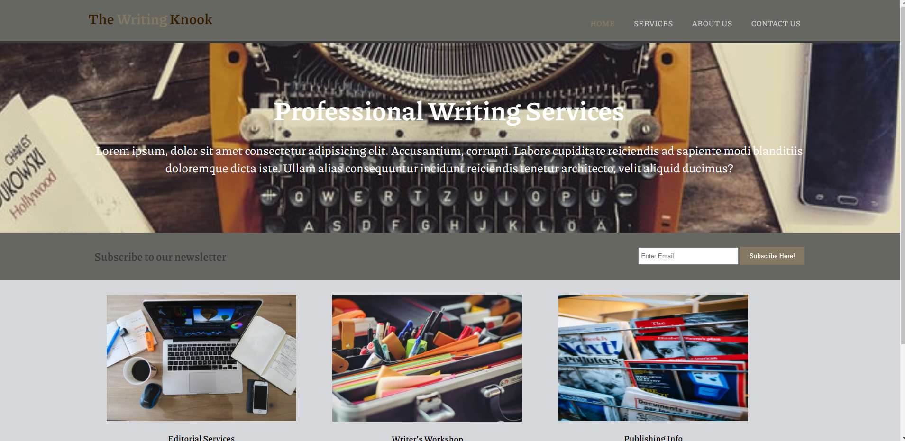

# Writing Knook

## Purpose

In 2020 I began to really taking learning to develop websites, and coding seriously.

I created this mock version of a professional writing service, learning how to use floats.

Now it is 2021, and I have learned a lot since 2020. And decided to revitalize this, for my portfolio using more modern methods. about

## Screen Shot

### Before (the 2020 version)

### After (the improved version.)

#My Process

## Approach

First I separated the existing files into their own folders.
The images were already in their respective folder, but I added a CSS folder and a views folder, for the 3 other pages on the site. about

## Reviewing Code

After separating the individual folders. I reviewed my html mark up and CSS properties. I was trying to identify where things needed to be placed, given the layout I already had in place. about

The background image for the pages, need to be adjusted. On larger screens they are really condensed, while on smaller screens they are looking how they should.

Updated the color scheme and font. I felt the colors used the first time clashed, and made it difficult to read the text in some areas of the website. about

And the font was updated for a more legible approach

## Varibles

Added some custom CSS variables, found some places where Sass or another preprocessor would make great use for mixins, partials and components, but decided to not use sass for this small project.
